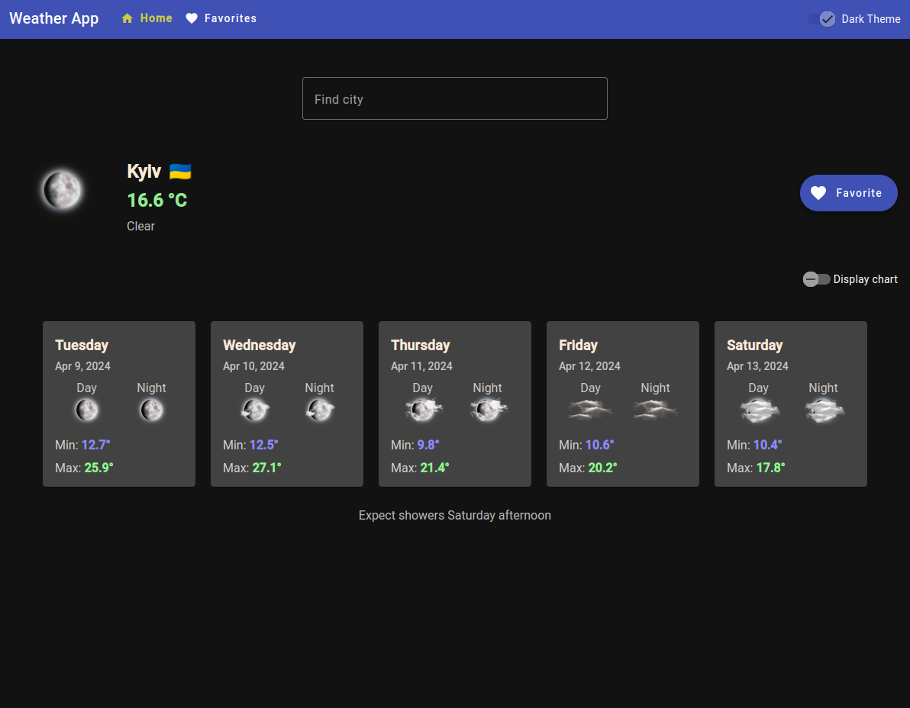
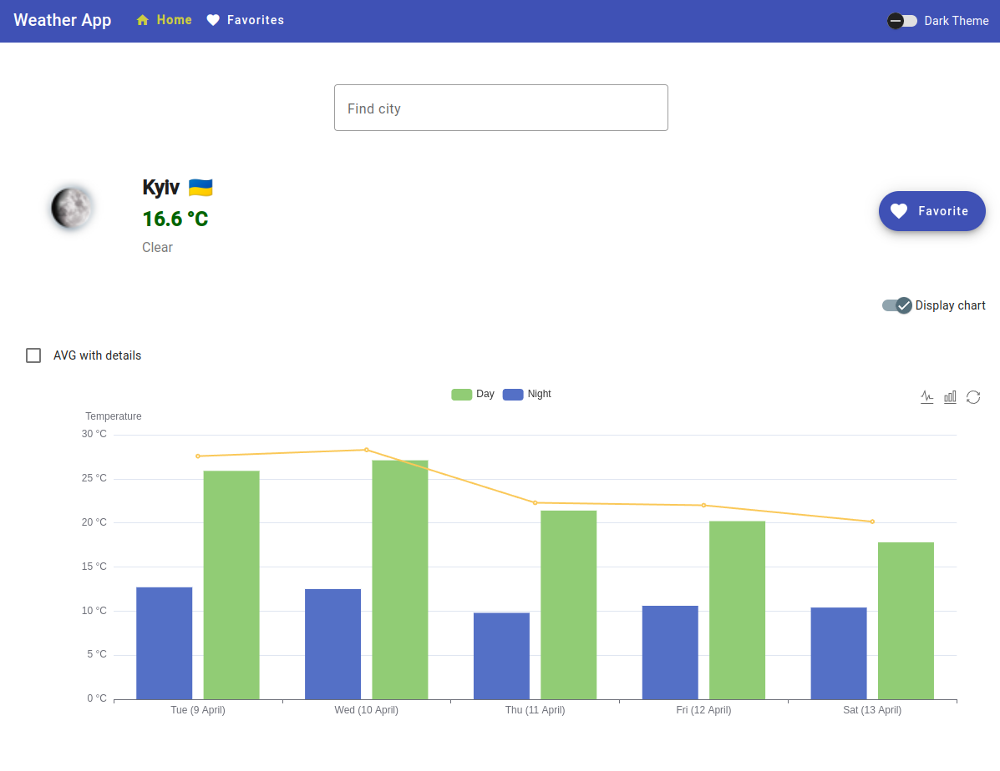

# Weather Watcher

## Stack

1. Angular 17
2. NgRx
3. Angular Material
4. Echarts

## How to Use

1. [Get an API key from the AccuWeather service](https://developer.accuweather.com/user/register)

2. Clone the project

   ```bash
   git clone https://github.com/oleksandr-kupenko/weather-watcher
   ```

3. Install dependencies

   ```bash
   npm i
   ```

4. Paste the API key into `src/environments/environment`.

   You can insert a string or an array. When using an array, the daily running time of the application increases.

   ```bash
   apiKey: ['some_key', 'some_key_2', ''some_key3'...]
   // or
   apiKey: 'some_key'
   ```

5. Start the server

   ```bash
   ng s
   ```

## Screenshots




